<!-- generated by scripts/build_stats.py and refreshed automatically by
     .github/workflows/update-stats.yml -->

 
 

<h3><code>crispinzz@github ~ $ ./links.sh</code></h3>

<b>Developer · Product Builder · Automation</b>

